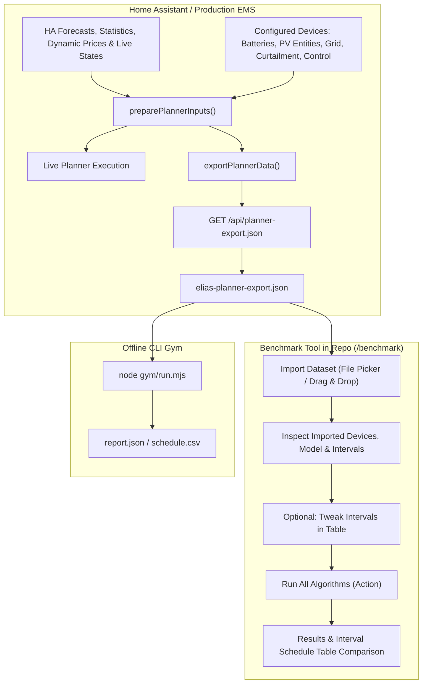

# Planner Data Export & Benchmark Import Implementation Plan

## Overview
This plan implements an end-to-end export and import pipeline for the EMS battery planner:
1. **Export from Home Assistant**: Capture all live inputs used by the planner—including interval solar forecasts, load profile forecasts, dynamic price slots, terminal reserve calculations, algorithm settings, and all configured devices (batteries, PV arrays, grid meter, curtailment config, price rules, and control settings)—into a clean, portable JSON dataset.
2. **Import into Benchmark Website (`/benchmark`)**: Allow uploading any exported dataset directly in the browser, viewing the configured devices and intervals, editing interval values if desired, and running all benchmark algorithms to calculate and compare interval schedule tables.
3. **CLI Benchmark Replay (`gym/run.mjs`, `gym/benchmark.mjs`)**: Ensure the exported dataset conforms to schema version 1 (`forecast-snapshot`), enabling zero-config offline runs via `node gym/run.mjs <export.json>`.



---

## 1. Export Dataset Schema (`PlannerExportDataset`)

The exported JSON satisfies both the benchmark dataset schema (version 1, `kind: "forecast-snapshot"`) and provides the complete device configuration:

```typescript
export type PlannerExportDataset = {
  schemaVersion: 1;
  id: string; // e.g., "household-export-2026-09-24T18-30-00"
  timeZone: string; // from HA energy profile / config
  currency: string; // e.g., "EUR"
  kind: "forecast-snapshot";
  capturedAt: string; // ISO timestamp
  requestedEnd: string; // ISO timestamp
  actualEnd: string; // ISO timestamp
  model: ChargeModel; // { capacityKwh, minSoc, maxSoc, soc, minW, maxW, stepW, dischargeW, efficiency, wearPerKwh }
  terminalReserveKwh: number;
  assumptions: string[];
  slots: ChargeInterval[]; // Array<{ start, end, solarW, loadW, buy, sell, estimatedPrice, curtailment? }>
  settings: {
    deadline: string; // ISO timestamp matching interval end
    targetSoc: number; // %
    solarHaircut: number; // e.g. 0.2
    switchCost: number; // e.g. 0.002
    passes: number; // e.g. 4
    spikeBufferKwh: number; // e.g. 0.54
    algorithm: string; // e.g. "cost-optimized" or "evening-target"
    algorithms: string[]; // ["cost-optimized", "evening-target"]
  };
  devices: {
    battery: Battery;
    batteries: Battery[];
    pvEntities: PvEntity[];
    grid: Grid;
    curtailment: CurtailmentConfig;
    control: ControlConfig;
    prices: PriceConfig;
  };
  context?: {
    loadProfile?: {
      timeZone: string;
      hours: number;
      watts: number[];
    };
    rawSolarForecast?: Array<{ start: number; wh: number }>;
    solarBySource?: Array<{
      energyEntityId: string;
      hours: Array<{ start: number; wh: number }>;
    }>;
  };
};
```

### Why this structure guarantees identical execution:
- In production, `calculateChargePlan` builds `slots` (with curtailment parameters), `model`, `reserve`, and `settings` before calling `optimizeCharge` or `evening`.
- Exporting this exact bundle ensures that candidate algorithms run offline with the identical input numbers, curtailment constraints, battery bounds, and tariffs.
- Extra fields like `devices` and `context` provide full transparency and debugging visibility without interfering with the optimizer or replay loop.

---

## 2. Refactoring & Core Server Logic

### A. Extract Data Preparation in `addon/app/lib/charge-planner.server.ts`
- Extract `preparePlannerInputs(battery: Battery, now = Date.now(), report = ...)` from `calculateChargePlan`:
  - Fetches and validates `readEnergyForecast`, `readPrices`, `readStates([socEntityId, chargeLimitEntityId])`.
  - Reads `readCurtailmentConfig`, `listPvEntities`, `readControlConfig`.
  - Constructs `slots: ChargeInterval[]` (applying PV curtailment modeling per interval, buy/sell prices, load watts, solar watts).
  - Calculates `terminalReserveKwh`.
  - Determines evening deadline if applicable.
  - Returns `{ slots, model, reserve, settings, timeZone, currency, forecastEnd, raw, ... }`.
- `calculateChargePlan` becomes concise: calls `preparePlannerInputs` and executes the selected algorithm (`evening` or `optimizeCharge`).

### B. New Module: `addon/app/lib/planner-export.server.ts`
- Exports `exportPlannerData(batteryId?: string, now = Date.now()): Promise<PlannerExportDataset>`.
  - Resolves target battery (or first battery with planning configured from `listBatteries()`).
  - Calls `preparePlannerInputs`.
  - Collects all device configurations in parallel: `listBatteries()`, `listPvEntities()`, `readGrid()`, `readCurtailmentConfig()`, `readControlConfig()`, `readPriceConfig()`.
  - Builds human-readable `assumptions` summarizing the export context (sources, dates, battery specs, curtailment mode).
  - Assembles and returns the full `PlannerExportDataset`.

### C. Generalized Benchmark Runner in `addon/app/lib/benchmark.server.ts`
- Update `runBenchmark(customInput?, customSettings?, values?)`:
  - Accepts an optional custom `input` and `settings`.
  - If omitted, defaults to bundled `input.json` and `experiment.json`.
  - Merges edited `values` into `input.slots`.
  - Runs all algorithms in `benchmarkAlgorithms` and evaluates scenarios.

---

## 3. Web Routes and UI Integration

### A. New API Resource Route: `addon/app/routes/api.planner-export[.]json.tsx`
- Resource route served at `/api/planner-export.json`.
- Uses `fileStamp(new Date())` for filename: `elias-planner-export-YYYY-MM-DD-HH-mm-ss.json`.
- Headers:
  - `Content-Type: application/json; charset=utf-8`
  - `Content-Disposition: attachment; filename="..."`
  - `Cache-Control: no-store`
- Handles errors cleanly with appropriate HTTP status and message.

### B. UI Export Buttons
1. **Energy Plans (`addon/app/routes/plans.tsx` / `ChargePlanCard.tsx`)**:
   - Add an **Export planner data** button (`<a href={useHref("/api/planner-export.json")} download ...>`).
   - Located on the plan card or next to the plan view controls.
2. **Tools (`addon/app/routes/tools.tsx`)**:
   - Add a dedicated **Planner Export** section with a "Download" button and description under Diagnostics.

### C. Import & Replay in Benchmark Website (`addon/app/routes/benchmark.tsx`)
1. **Import UI**:
   - Add an **Import dataset** file picker button (accepts `.json`).
   - Client-side JSON parse and validation:
     - Checks `schemaVersion`, `slots`, `model`, `terminalReserveKwh`.
     - Validates that `slots` is a non-empty array with required numeric fields.
   - When loaded:
     - Sets the imported dataset into state (`currentDataset`, `currentSettings`).
     - Updates page header (interval dates, timezone, interval count, battery capacity).
     - Populates the editable interval table (`BenchmarkDataset`).
     - Renders an **Imported devices & configuration** collapsible card (showing Battery, PV arrays, Curtailment, Prices, Control).
     - Renders an active banner: *"Using imported dataset: {id} ({slots.length} intervals) · [Reset to bundled dataset]"*.
2. **Form Action Submission**:
   - Submits `dataset` (edited values) along with `baseDataset` and `baseSettings` (serialized JSON) when a custom dataset is active.
   - In `action`:
     - Parses `baseDataset` and `baseSettings` if present (or falls back to bundled defaults).
     - Validates table draft values against the actual number of intervals (`baseDataset.slots.length`).
     - Calls `runBenchmark(baseDataset, baseSettings, values)`.
3. **Schedule Table & Comparison**:
   - Displays algorithm metrics comparison tables (Measured solar & Reduced solar).
   - "Compare interval schedules" table displays the schedule table for every interval:
     - Interval time, Solar, Demand, Import, Export, plus each algorithm's charge ceiling (W) and SoC (%).
4. **Export Current Dataset**:
   - Include an "Export current dataset" button to download any edited/imported dataset as JSON directly from `/benchmark`.

---

## 4. CLI Benchmark Compatibility (`gym/run.mjs` & `gym/benchmark.mjs`)

- **`gym/run.mjs`**:
  - Update settings resolution: if `settingsFile` is not explicitly provided on the CLI and `data.settings` is present in the input file, use `data.settings`.
  - This allows running `node gym/run.mjs my-export.json` directly without date mismatches on the evening deadline.
- **`gym/benchmark.mjs`**:
  - Similarly use `input.settings` when present and CLI settings are not passed.

---

## 5. Verification & Testing

1. **Unit Tests**:
   - `addon/test/unit/planner-export.test.ts`:
     - Test `preparePlannerInputs` produces valid model, slots, reserve, and settings.
     - Test `exportPlannerData` produces a valid `PlannerExportDataset` containing all configured devices (batteries, PV entities, curtailment, grid, prices).
     - Test error handling when required planning entities are missing.
   - `addon/test/unit/benchmark.test.ts`:
     - Test `runBenchmark` with custom input and custom settings of arbitrary length (e.g. 96 intervals).
     - Test validation rejects invalid custom datasets.
2. **Integration / Route Tests**:
   - Test `GET /api/planner-export.json` returns valid JSON with `Content-Disposition: attachment`.
   - Test `POST /benchmark` with custom imported dataset runs all algorithms and returns report.
3. **CLI Gym Tests**:
   - Run `node gym/run.mjs` with an exported dataset and verify `report.json` and `schedule.csv` are produced.
   - Run `node --test gym/test/*.test.mjs`.
4. **Full Workspace Checks**:
   - `npm run typecheck`
   - `npm run lint`
   - `npm test`
